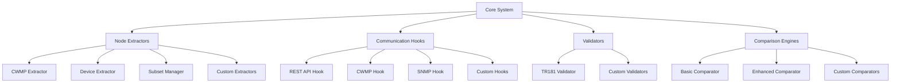

# TR181 Node Comparator Developer Guide

## Table of Contents

1. [Architecture Overview](#architecture-overview)
2. [Extending Device Communication Hooks](#extending-device-communication-hooks)
3. [Adding New Device Types](#adding-new-device-types)
4. [Custom Extractors](#custom-extractors)
5. [Custom Validators](#custom-validators)
6. [Plugin System](#plugin-system)
7. [Testing Guidelines](#testing-guidelines)
8. [Contributing Guidelines](#contributing-guidelines)
9. [API Extension Points](#api-extension-points)

## Architecture Overview

The TR181 Node Comparator follows a modular, plugin-based architecture that allows for easy extension and customization. The main extension points are:



### Key Extension Points

1. **Device Communication Hooks**: Implement new protocols for device communication
2. **Node Extractors**: Create extractors for new data sources
3. **Validators**: Add custom validation rules and logic
4. **Comparison Engines**: Implement specialized comparison algorithms
5. **Report Generators**: Create custom output formats and reports

## Extending Device Communication Hooks

Device communication hooks provide the interface between the comparator and actual devices. To create a new hook:

### 1. Implement the DeviceConnectionHook Interface

```python
from abc import ABC, abstractmethod
from typing import Dict, List, Any, Optional
from tr181_comparator.hooks import DeviceConnectionHook
from tr181_comparator.config import DeviceConfig
from tr181_comparator.errors import ConnectionError, ValidationError

class MyCustomHook(DeviceConnectionHook):
    """Custom device communication hook example."""
    
    def __init__(self):
        self.connection = None
        self.config = None
        self.session_id = None
    
    async def connect(self, config: DeviceConfig) -> bool:
        """Establish connection to device using custom protocol."""
        try:
            self.config = config
            
            # Initialize your custom connection
            self.connection = await self._create_connection(config)
            
            # Perform authentication
            await self._authenticate()
            
            # Test basic connectivity
            if await self._test_connection():
                return True
            else:
                raise ConnectionError("Connection test failed")
                
        except Exception as e:
            raise ConnectionError(f"Failed to connect: {str(e)}")
    
    async def disconnect(self) -> None:
        """Close device connection."""
        if self.connection:
            try:
                await self._cleanup_session()
                await self.connection.close()
            except Exception as e:
                print(f"Warning: Error during disconnect: {e}")
            finally:
                self.connection = None
                self.session_id = None
    
    async def get_parameter_names(self, path_prefix: str = "Device.") -> List[str]:
        """Get all parameter names under the specified path."""
        if not self.connection:
            raise ConnectionError("Not connected to device")
        
        try:
            # Implement your protocol-specific parameter discovery
            request = self._build_parameter_names_request(path_prefix)
            response = await self._send_request(request)
            return self._parse_parameter_names_response(response)
            
        except Exception as e:
            raise ValidationError(f"Failed to get parameter names: {str(e)}")
    
    async def get_parameter_values(self, paths: List[str]) -> Dict[str, Any]:
        """Get current values for specified parameter paths."""
        if not self.connection:
            raise ConnectionError("Not connected to device")
        
        try:
            # Batch requests for efficiency
            batches = self._create_batches(paths, batch_size=50)
            all_values = {}
            
            for batch in batches:
                request = self._build_parameter_values_request(batch)
                response = await self._send_request(request)
                batch_values = self._parse_parameter_values_response(response)
                all_values.update(batch_values)
            
            return all_values
            
        except Exception as e:
            raise ValidationError(f"Failed to get parameter values: {str(e)}")
    
    async def get_parameter_attributes(self, paths: List[str]) -> Dict[str, Dict[str, Any]]:
        """Get parameter attributes (type, access, etc.) for specified paths."""
        if not self.connection:
            raise ConnectionError("Not connected to device")
        
        try:
            request = self._build_parameter_attributes_request(paths)
            response = await self._send_request(request)
            return self._parse_parameter_attributes_response(response)
            
        except Exception as e:
            raise ValidationError(f"Failed to get parameter attributes: {str(e)}")
    
    async def set_parameter_values(self, values: Dict[str, Any]) -> bool:
        """Set parameter values (for testing write access)."""
        if not self.connection:
            raise ConnectionError("Not connected to device")
        
        try:
            request = self._build_set_parameter_values_request(values)
            response = await self._send_request(request)
            return self._parse_set_parameter_values_response(response)
            
        except Exception as e:
            raise ValidationError(f"Failed to set parameter values: {str(e)}")
    
    async def subscribe_to_event(self, event_path: str) -> bool:
        """Subscribe to device event notifications."""
        if not self.connection:
            raise ConnectionError("Not connected to device")
        
        try:
            request = self._build_event_subscription_request(event_path)
            response = await self._send_request(request)
            return self._parse_event_subscription_response(response)
            
        except Exception as e:
            raise ValidationError(f"Failed to subscribe to event: {str(e)}")
    
    async def call_function(self, function_path: str, input_params: Dict[str, Any]) -> Dict[str, Any]:
        """Call device function with input parameters."""
        if not self.connection:
            raise ConnectionError("Not connected to device")
        
        try:
            request = self._build_function_call_request(function_path, input_params)
            response = await self._send_request(request)
            return self._parse_function_call_response(response)
            
        except Exception as e:
            raise ValidationError(f"Failed to call function: {str(e)}")
    
    # Private helper methods (implement based on your protocol)
    
    async def _create_connection(self, config: DeviceConfig):
        """Create the actual connection object."""
        # Implement your connection logic here
        # This could be HTTP session, TCP socket, etc.
        pass
    
    async def _authenticate(self):
        """Perform authentication with the device."""
        auth_config = self.config.authentication
        
        if auth_config.get('type') == 'basic':
            # Implement basic authentication
            pass
        elif auth_config.get('type') == 'custom':
            # Implement your custom authentication
            pass
        else:
            raise ValidationError(f"Unsupported auth type: {auth_config.get('type')}")
    
    async def _test_connection(self) -> bool:
        """Test basic connectivity."""
        try:
            # Implement a simple test request
            test_request = self._build_test_request()
            response = await self._send_request(test_request)
            return self._is_valid_response(response)
        except:
            return False
    
    async def _send_request(self, request):
        """Send request to device and return response."""
        # Implement your protocol-specific request sending
        pass
    
    def _build_parameter_names_request(self, path_prefix: str):
        """Build protocol-specific request for parameter names."""
        # Implement based on your protocol
        pass
    
    def _parse_parameter_names_response(self, response) -> List[str]:
        """Parse response and extract parameter names."""
        # Implement based on your protocol
        pass
    
    # ... implement other helper methods
```

### 2. Register Your Hook

```python
from tr181_comparator.hooks import DeviceHookFactory

# Register your custom hook
DeviceHookFactory.register_hook('mycustom', MyCustomHook)

# Now you can use it in device configurations
device_config = DeviceConfig(
    name="custom_device",
    type="mycustom",  # This will use your custom hook
    endpoint="custom://device.local:1234",
    authentication={
        "type": "custom",
        "api_key": "your-api-key"
    }
)
```

### 3. Example: MQTT Hook Implementation

Here's a complete example of an MQTT-based hook:

```python
import asyncio
import json
from typing import Dict, List, Any
import paho.mqtt.client as mqtt
from tr181_comparator.hooks import DeviceConnectionHook

class MQTTHook(DeviceConnectionHook):
    """MQTT-based device communication hook."""
    
    def __init__(self):
        self.client = None
        self.connected = False
        self.responses = {}
        self.response_events = {}
    
    async def connect(self, config: DeviceConfig) -> bool:
        """Connect to MQTT broker and device."""
        try:
            # Parse MQTT broker from endpoint
            # Format: mqtt://broker.local:1883/device_topic
            parts = config.endpoint.replace('mqtt://', '').split('/')
            broker_port = parts[0].split(':')
            broker = broker_port[0]
            port = int(broker_port[1]) if len(broker_port) > 1 else 1883
            self.device_topic = parts[1] if len(parts) > 1 else 'device'
            
            # Create MQTT client
            self.client = mqtt.Client()
            
            # Set authentication if provided
            auth = config.authentication
            if auth.get('username') and auth.get('password'):
                self.client.username_pw_set(auth['username'], auth['password'])
            
            # Set up callbacks
            self.client.on_connect = self._on_connect
            self.client.on_message = self._on_message
            
            # Connect to broker
            self.client.connect(broker, port, 60)
            self.client.loop_start()
            
            # Wait for connection
            for _ in range(50):  # 5 second timeout
                if self.connected:
                    break
                await asyncio.sleep(0.1)
            
            if not self.connected:
                raise ConnectionError("Failed to connect to MQTT broker")
            
            # Subscribe to response topic
            response_topic = f"{self.device_topic}/response"
            self.client.subscribe(response_topic)
            
            return True
            
        except Exception as e:
            raise ConnectionError(f"MQTT connection failed: {str(e)}")
    
    async def disconnect(self) -> None:
        """Disconnect from MQTT broker."""
        if self.client:
            self.client.loop_stop()
            self.client.disconnect()
            self.connected = False
    
    async def get_parameter_names(self, path_prefix: str = "Device.") -> List[str]:
        """Get parameter names via MQTT."""
        request = {
            "method": "GetParameterNames",
            "params": {"path": path_prefix},
            "id": self._generate_request_id()
        }
        
        response = await self._send_mqtt_request(request)
        return response.get('result', {}).get('parameters', [])
    
    async def get_parameter_values(self, paths: List[str]) -> Dict[str, Any]:
        """Get parameter values via MQTT."""
        request = {
            "method": "GetParameterValues",
            "params": {"paths": paths},
            "id": self._generate_request_id()
        }
        
        response = await self._send_mqtt_request(request)
        return response.get('result', {}).get('values', {})
    
    async def get_parameter_attributes(self, paths: List[str]) -> Dict[str, Dict[str, Any]]:
        """Get parameter attributes via MQTT."""
        request = {
            "method": "GetParameterAttributes",
            "params": {"paths": paths},
            "id": self._generate_request_id()
        }
        
        response = await self._send_mqtt_request(request)
        return response.get('result', {}).get('attributes', {})
    
    async def set_parameter_values(self, values: Dict[str, Any]) -> bool:
        """Set parameter values via MQTT."""
        request = {
            "method": "SetParameterValues",
            "params": {"values": values},
            "id": self._generate_request_id()
        }
        
        response = await self._send_mqtt_request(request)
        return response.get('result', {}).get('success', False)
    
    async def subscribe_to_event(self, event_path: str) -> bool:
        """Subscribe to events via MQTT."""
        event_topic = f"{self.device_topic}/events/{event_path.replace('.', '/')}"
        self.client.subscribe(event_topic)
        return True
    
    async def call_function(self, function_path: str, input_params: Dict[str, Any]) -> Dict[str, Any]:
        """Call function via MQTT."""
        request = {
            "method": "CallFunction",
            "params": {
                "function": function_path,
                "input": input_params
            },
            "id": self._generate_request_id()
        }
        
        response = await self._send_mqtt_request(request)
        return response.get('result', {})
    
    # Private methods
    
    def _on_connect(self, client, userdata, flags, rc):
        """MQTT connection callback."""
        if rc == 0:
            self.connected = True
        else:
            print(f"MQTT connection failed with code {rc}")
    
    def _on_message(self, client, userdata, msg):
        """MQTT message callback."""
        try:
            response = json.loads(msg.payload.decode())
            request_id = response.get('id')
            
            if request_id and request_id in self.response_events:
                self.responses[request_id] = response
                self.response_events[request_id].set()
                
        except Exception as e:
            print(f"Error processing MQTT message: {e}")
    
    async def _send_mqtt_request(self, request):
        """Send request via MQTT and wait for response."""
        request_id = request['id']
        
        # Set up response waiting
        self.response_events[request_id] = asyncio.Event()
        
        # Send request
        request_topic = f"{self.device_topic}/request"
        self.client.publish(request_topic, json.dumps(request))
        
        # Wait for response (with timeout)
        try:
            await asyncio.wait_for(
                self.response_events[request_id].wait(),
                timeout=30.0
            )
            
            response = self.responses.get(request_id, {})
            
            # Cleanup
            del self.response_events[request_id]
            if request_id in self.responses:
                del self.responses[request_id]
            
            return response
            
        except asyncio.TimeoutError:
            # Cleanup on timeout
            if request_id in self.response_events:
                del self.response_events[request_id]
            raise ConnectionError("MQTT request timeout")
    
    def _generate_request_id(self):
        """Generate unique request ID."""
        import uuid
        return str(uuid.uuid4())

# Register the MQTT hook
DeviceHookFactory.register_hook('mqtt', MQTTHook)
```

## Adding New Device Types

To add support for a new device type, you typically need to:

1. **Create a custom hook** (as shown above)
2. **Create a specialized extractor** (if needed)
3. **Add device-specific configuration options**
4. **Implement device-specific validation rules**

### Example: Adding IoT Device Support

```python
from tr181_comparator.extractors import NodeExtractor
from tr181_comparator.models import TR181Node, AccessLevel, SourceInfo

class IoTDeviceExtractor(NodeExtractor):
    """Extractor for IoT devices with limited TR181 support."""
    
    def __init__(self, device_config: DeviceConfig):
        self.device_config = device_config
        self.hook = DeviceHookFactory.create_hook(device_config.type)
        self.iot_mappings = self._load_iot_mappings()
    
    async def extract(self) -> List[TR181Node]:
        """Extract TR181 nodes from IoT device."""
        await self.hook.connect(self.device_config)
        
        try:
            # IoT devices might not support full TR181 parameter discovery
            # Use predefined mappings instead
            nodes = []
            
            for iot_param, tr181_mapping in self.iot_mappings.items():
                try:
                    # Get value from IoT device
                    iot_values = await self.hook.get_parameter_values([iot_param])
                    iot_value = iot_values.get(iot_param)
                    
                    if iot_value is not None:
                        # Map to TR181 format
                        tr181_node = TR181Node(
                            path=tr181_mapping['path'],
                            name=tr181_mapping['name'],
                            data_type=tr181_mapping['type'],
                            access=AccessLevel(tr181_mapping['access']),
                            value=self._convert_iot_value(iot_value, tr181_mapping),
                            description=tr181_mapping.get('description'),
                            is_custom=tr181_mapping.get('is_custom', False)
                        )
                        nodes.append(tr181_node)
                        
                except Exception as e:
                    print(f"Warning: Failed to extract {iot_param}: {e}")
                    continue
            
            return nodes
            
        finally:
            await self.hook.disconnect()
    
    async def validate(self) -> bool:
        """Validate IoT device connectivity."""
        try:
            await self.hook.connect(self.device_config)
            # Test basic connectivity
            test_result = await self.hook.get_parameter_names()
            await self.hook.disconnect()
            return len(test_result) > 0
        except:
            return False
    
    def get_source_info(self) -> SourceInfo:
        """Get IoT device source information."""
        return SourceInfo(
            type="iot_device",
            identifier=self.device_config.name,
            timestamp=datetime.now(),
            metadata={
                "device_type": self.device_config.type,
                "endpoint": self.device_config.endpoint,
                "mapping_version": "1.0"
            }
        )
    
    def _load_iot_mappings(self) -> Dict[str, Dict[str, Any]]:
        """Load IoT to TR181 parameter mappings."""
        # This could be loaded from a configuration file
        return {
            "temperature": {
                "path": "Device.Environment.Temperature",
                "name": "Temperature",
                "type": "int",
                "access": "read-only",
                "description": "Current temperature in Celsius",
                "is_custom": True,
                "conversion": "celsius_to_int"
            },
            "humidity": {
                "path": "Device.Environment.Humidity",
                "name": "Humidity",
                "type": "int",
                "access": "read-only",
                "description": "Current humidity percentage",
                "is_custom": True,
                "conversion": "percentage_to_int"
            },
            "wifi_ssid": {
                "path": "Device.WiFi.AccessPoint.1.SSID",
                "name": "SSID",
                "type": "string",
                "access": "read-write",
                "description": "WiFi network name"
            }
        }
    
    def _convert_iot_value(self, iot_value, mapping):
        """Convert IoT device value to TR181 format."""
        conversion = mapping.get('conversion')
        
        if conversion == 'celsius_to_int':
            return int(float(iot_value))
        elif conversion == 'percentage_to_int':
            return int(float(iot_value))
        else:
            # Default conversion based on target type
            target_type = mapping['type']
            if target_type == 'int':
                return int(iot_value)
            elif target_type == 'boolean':
                return str(iot_value).lower() in ('true', '1', 'on', 'yes')
            else:
                return str(iot_value)
```

## Custom Extractors

You can create custom extractors for specialized data sources:

```python
from tr181_comparator.extractors import NodeExtractor

class DatabaseExtractor(NodeExtractor):
    """Extract TR181 nodes from database."""
    
    def __init__(self, db_connection_string: str):
        self.db_connection_string = db_connection_string
        self.connection = None
    
    async def extract(self) -> List[TR181Node]:
        """Extract nodes from database."""
        await self._connect_db()
        
        try:
            query = """
            SELECT path, name, data_type, access_level, current_value, description
            FROM tr181_parameters
            WHERE active = true
            ORDER BY path
            """
            
            rows = await self._execute_query(query)
            nodes = []
            
            for row in rows:
                node = TR181Node(
                    path=row['path'],
                    name=row['name'],
                    data_type=row['data_type'],
                    access=AccessLevel(row['access_level']),
                    value=row['current_value'],
                    description=row['description']
                )
                nodes.append(node)
            
            return nodes
            
        finally:
            await self._disconnect_db()
    
    async def validate(self) -> bool:
        """Validate database connectivity."""
        try:
            await self._connect_db()
            result = await self._execute_query("SELECT 1")
            await self._disconnect_db()
            return len(result) > 0
        except:
            return False
    
    def get_source_info(self) -> SourceInfo:
        """Get database source information."""
        return SourceInfo(
            type="database",
            identifier=self.db_connection_string,
            timestamp=datetime.now(),
            metadata={"source": "postgresql"}
        )
    
    async def _connect_db(self):
        """Connect to database."""
        # Implement database connection
        pass
    
    async def _disconnect_db(self):
        """Disconnect from database."""
        pass
    
    async def _execute_query(self, query: str):
        """Execute database query."""
        # Implement query execution
        pass
```

## Custom Validators

Create custom validation rules for specific requirements:

```python
from tr181_comparator.validation import TR181Validator, ValidationResult

class EnterpriseValidator(TR181Validator):
    """Enterprise-specific TR181 validation rules."""
    
    def __init__(self):
        super().__init__()
        self.enterprise_rules = self._load_enterprise_rules()
    
    def validate_node(self, node: TR181Node, actual_value: Any = None) -> ValidationResult:
        """Validate node with enterprise rules."""
        # First run standard validation
        result = super().validate_node(node, actual_value)
        
        # Add enterprise-specific validation
        self._validate_enterprise_rules(node, actual_value, result)
        self._validate_security_requirements(node, actual_value, result)
        self._validate_compliance_requirements(node, actual_value, result)
        
        return result
    
    def _validate_enterprise_rules(self, node: TR181Node, value: Any, result: ValidationResult):
        """Apply enterprise-specific validation rules."""
        for rule in self.enterprise_rules:
            if self._rule_applies(rule, node):
                if not self._check_rule(rule, node, value):
                    if rule['severity'] == 'error':
                        result.add_error(f"Enterprise rule violation: {rule['message']}")
                    else:
                        result.add_warning(f"Enterprise rule warning: {rule['message']}")
    
    def _validate_security_requirements(self, node: TR181Node, value: Any, result: ValidationResult):
        """Validate security requirements."""
        # Check for sensitive parameters
        sensitive_patterns = [
            'Password', 'Key', 'Secret', 'Token', 'Credential'
        ]
        
        for pattern in sensitive_patterns:
            if pattern in node.path and node.access != AccessLevel.WRITE_ONLY:
                result.add_warning(f"Sensitive parameter {node.path} should be write-only")
        
        # Check for default passwords
        if 'Password' in node.path and value in ['admin', 'password', '123456', 'default']:
            result.add_error(f"Default password detected in {node.path}")
    
    def _validate_compliance_requirements(self, node: TR181Node, value: Any, result: ValidationResult):
        """Validate regulatory compliance requirements."""
        # Example: WiFi channel compliance
        if 'WiFi.Radio' in node.path and 'Channel' in node.name:
            if value and value not in self._get_allowed_wifi_channels():
                result.add_error(f"WiFi channel {value} not allowed in this region")
        
        # Example: Power level compliance
        if 'TransmitPower' in node.path:
            max_power = self._get_max_transmit_power(node.path)
            if value and value > max_power:
                result.add_error(f"Transmit power {value} exceeds regulatory limit {max_power}")
    
    def _load_enterprise_rules(self):
        """Load enterprise validation rules."""
        return [
            {
                "name": "SSID_naming_convention",
                "pattern": "Device.WiFi.AccessPoint.*.SSID",
                "rule": "must_start_with",
                "value": "CORP_",
                "severity": "error",
                "message": "SSID must start with CORP_ prefix"
            },
            {
                "name": "admin_password_complexity",
                "pattern": "Device.Users.User.*.Password",
                "rule": "min_complexity",
                "value": 8,
                "severity": "error",
                "message": "Admin password must be at least 8 characters"
            }
        ]
    
    def _rule_applies(self, rule, node):
        """Check if rule applies to node."""
        import fnmatch
        return fnmatch.fnmatch(node.path, rule['pattern'])
    
    def _check_rule(self, rule, node, value):
        """Check if node/value satisfies rule."""
        if rule['rule'] == 'must_start_with':
            return str(value).startswith(rule['value']) if value else False
        elif rule['rule'] == 'min_complexity':
            return len(str(value)) >= rule['value'] if value else False
        return True
    
    def _get_allowed_wifi_channels(self):
        """Get allowed WiFi channels for current region."""
        # This would be configurable based on regulatory domain
        return [1, 6, 11, 36, 40, 44, 48, 149, 153, 157, 161]
    
    def _get_max_transmit_power(self, path):
        """Get maximum allowed transmit power."""
        if '2.4GHz' in path:
            return 20  # dBm
        elif '5GHz' in path:
            return 23  # dBm
        return 20  # Default
```

## Plugin System

Implement a plugin system for easy extension:

```python
import importlib
import pkgutil
from typing import Dict, Type, Any

class PluginManager:
    """Manages plugins for the TR181 comparator."""
    
    def __init__(self):
        self.hooks: Dict[str, Type[DeviceConnectionHook]] = {}
        self.extractors: Dict[str, Type[NodeExtractor]] = {}
        self.validators: Dict[str, Type[TR181Validator]] = {}
        self.comparators: Dict[str, Type[ComparisonEngine]] = {}
    
    def register_hook(self, name: str, hook_class: Type[DeviceConnectionHook]):
        """Register a device communication hook."""
        self.hooks[name] = hook_class
    
    def register_extractor(self, name: str, extractor_class: Type[NodeExtractor]):
        """Register a node extractor."""
        self.extractors[name] = extractor_class
    
    def register_validator(self, name: str, validator_class: Type[TR181Validator]):
        """Register a validator."""
        self.validators[name] = validator_class
    
    def register_comparator(self, name: str, comparator_class: Type[ComparisonEngine]):
        """Register a comparison engine."""
        self.comparators[name] = comparator_class
    
    def get_hook(self, name: str) -> Type[DeviceConnectionHook]:
        """Get hook class by name."""
        return self.hooks.get(name)
    
    def get_extractor(self, name: str) -> Type[NodeExtractor]:
        """Get extractor class by name."""
        return self.extractors.get(name)
    
    def get_validator(self, name: str) -> Type[TR181Validator]:
        """Get validator class by name."""
        return self.validators.get(name)
    
    def get_comparator(self, name: str) -> Type[ComparisonEngine]:
        """Get comparator class by name."""
        return self.comparators.get(name)
    
    def load_plugins(self, plugin_package: str = "tr181_comparator.plugins"):
        """Automatically load plugins from package."""
        try:
            package = importlib.import_module(plugin_package)
            for importer, modname, ispkg in pkgutil.iter_modules(package.__path__):
                module_name = f"{plugin_package}.{modname}"
                try:
                    module = importlib.import_module(module_name)
                    self._register_module_plugins(module)
                except Exception as e:
                    print(f"Failed to load plugin {module_name}: {e}")
        except ImportError:
            print(f"Plugin package {plugin_package} not found")
    
    def _register_module_plugins(self, module):
        """Register plugins from a module."""
        # Look for plugin registration functions
        if hasattr(module, 'register_plugins'):
            module.register_plugins(self)
        
        # Auto-discover plugin classes
        for attr_name in dir(module):
            attr = getattr(module, attr_name)
            if isinstance(attr, type):
                if issubclass(attr, DeviceConnectionHook) and attr != DeviceConnectionHook:
                    plugin_name = getattr(attr, 'PLUGIN_NAME', attr_name.lower())
                    self.register_hook(plugin_name, attr)
                elif issubclass(attr, NodeExtractor) and attr != NodeExtractor:
                    plugin_name = getattr(attr, 'PLUGIN_NAME', attr_name.lower())
                    self.register_extractor(plugin_name, attr)
                # ... similar for other plugin types

# Global plugin manager instance
plugin_manager = PluginManager()

# Example plugin module (tr181_comparator/plugins/mqtt_plugin.py)
def register_plugins(manager: PluginManager):
    """Register MQTT plugins."""
    manager.register_hook('mqtt', MQTTHook)
    manager.register_extractor('mqtt_extractor', MQTTExtractor)
```

## Testing Guidelines

### Unit Testing Custom Hooks

```python
import pytest
import asyncio
from unittest.mock import AsyncMock, MagicMock
from tr181_comparator.config import DeviceConfig

class TestMyCustomHook:
    """Test suite for custom hook."""
    
    @pytest.fixture
    def hook(self):
        """Create hook instance for testing."""
        return MyCustomHook()
    
    @pytest.fixture
    def device_config(self):
        """Create test device configuration."""
        return DeviceConfig(
            name="test_device",
            type="mycustom",
            endpoint="custom://test.local:1234",
            authentication={
                "type": "custom",
                "api_key": "test_key"
            }
        )
    
    @pytest.mark.asyncio
    async def test_connect_success(self, hook, device_config):
        """Test successful connection."""
        # Mock the connection creation
        hook._create_connection = AsyncMock(return_value=MagicMock())
        hook._authenticate = AsyncMock()
        hook._test_connection = AsyncMock(return_value=True)
        
        result = await hook.connect(device_config)
        assert result is True
        assert hook.config == device_config
    
    @pytest.mark.asyncio
    async def test_connect_failure(self, hook, device_config):
        """Test connection failure."""
        hook._create_connection = AsyncMock(side_effect=Exception("Connection failed"))
        
        with pytest.raises(ConnectionError):
            await hook.connect(device_config)
    
    @pytest.mark.asyncio
    async def test_get_parameter_names(self, hook, device_config):
        """Test parameter name retrieval."""
        # Set up mock connection
        hook.connection = MagicMock()
        hook._send_request = AsyncMock(return_value={"parameters": ["Device.Test.Param1", "Device.Test.Param2"]})
        hook._build_parameter_names_request = MagicMock(return_value={"request": "test"})
        hook._parse_parameter_names_response = MagicMock(return_value=["Device.Test.Param1", "Device.Test.Param2"])
        
        result = await hook.get_parameter_names("Device.Test")
        assert result == ["Device.Test.Param1", "Device.Test.Param2"]
    
    @pytest.mark.asyncio
    async def test_get_parameter_values(self, hook, device_config):
        """Test parameter value retrieval."""
        hook.connection = MagicMock()
        hook._create_batches = MagicMock(return_value=[["Device.Test.Param1"]])
        hook._send_request = AsyncMock(return_value={"values": {"Device.Test.Param1": "test_value"}})
        hook._build_parameter_values_request = MagicMock()
        hook._parse_parameter_values_response = MagicMock(return_value={"Device.Test.Param1": "test_value"})
        
        result = await hook.get_parameter_values(["Device.Test.Param1"])
        assert result == {"Device.Test.Param1": "test_value"}
```

### Integration Testing

```python
@pytest.mark.integration
class TestCustomHookIntegration:
    """Integration tests for custom hook."""
    
    @pytest.fixture
    def real_device_config(self):
        """Real device configuration for integration testing."""
        return DeviceConfig(
            name="integration_test_device",
            type="mycustom",
            endpoint=os.environ.get("TEST_DEVICE_ENDPOINT", "custom://localhost:1234"),
            authentication={
                "type": "custom",
                "api_key": os.environ.get("TEST_API_KEY", "test_key")
            }
        )
    
    @pytest.mark.asyncio
    async def test_full_extraction_workflow(self, real_device_config):
        """Test complete extraction workflow."""
        hook = MyCustomHook()
        
        try:
            # Connect
            connected = await hook.connect(real_device_config)
            assert connected
            
            # Get parameter names
            param_names = await hook.get_parameter_names()
            assert len(param_names) > 0
            
            # Get parameter values
            if param_names:
                values = await hook.get_parameter_values(param_names[:5])  # Test first 5
                assert isinstance(values, dict)
            
            # Get parameter attributes
            if param_names:
                attributes = await hook.get_parameter_attributes(param_names[:5])
                assert isinstance(attributes, dict)
                
        finally:
            await hook.disconnect()
```

## Contributing Guidelines

### Code Style

- Follow PEP 8 style guidelines
- Use type hints for all public methods
- Write comprehensive docstrings
- Include examples in docstrings where helpful

### Documentation

- Update API documentation for new classes/methods
- Add examples to the user guide
- Update troubleshooting guide for new error scenarios
- Include developer documentation for extension points

### Testing

- Write unit tests for all new functionality
- Include integration tests for device communication
- Test error handling and edge cases
- Maintain test coverage above 80%

### Pull Request Process

1. Fork the repository
2. Create a feature branch
3. Implement your changes with tests
4. Update documentation
5. Submit pull request with detailed description

## API Extension Points

### Hook Factory Extension

```python
class CustomHookFactory(DeviceHookFactory):
    """Extended hook factory with custom hooks."""
    
    @classmethod
    def create_hook(cls, device_type: str) -> DeviceConnectionHook:
        """Create hook instance with custom types."""
        if device_type in cls.custom_hooks:
            return cls.custom_hooks[device_type]()
        return super().create_hook(device_type)
    
    @classmethod
    def register_custom_hook(cls, device_type: str, hook_class: Type[DeviceConnectionHook]):
        """Register custom hook type."""
        if not hasattr(cls, 'custom_hooks'):
            cls.custom_hooks = {}
        cls.custom_hooks[device_type] = hook_class
```

### Comparison Engine Extension

```python
class CustomComparisonEngine(EnhancedComparisonEngine):
    """Extended comparison engine with custom logic."""
    
    def __init__(self):
        super().__init__()
        self.custom_comparators = {}
    
    def register_custom_comparator(self, node_pattern: str, comparator_func):
        """Register custom comparison logic for specific node patterns."""
        self.custom_comparators[node_pattern] = comparator_func
    
    async def compare_nodes(self, node1: TR181Node, node2: TR181Node) -> List[NodeDifference]:
        """Compare nodes with custom logic."""
        # Check for custom comparators
        for pattern, comparator in self.custom_comparators.items():
            if fnmatch.fnmatch(node1.path, pattern):
                return await comparator(node1, node2)
        
        # Fall back to standard comparison
        return await super().compare_nodes(node1, node2)
```

This developer guide provides comprehensive information for extending the TR181 Node Comparator with custom functionality. The modular architecture makes it easy to add new device types, communication protocols, and validation rules while maintaining compatibility with the existing system.